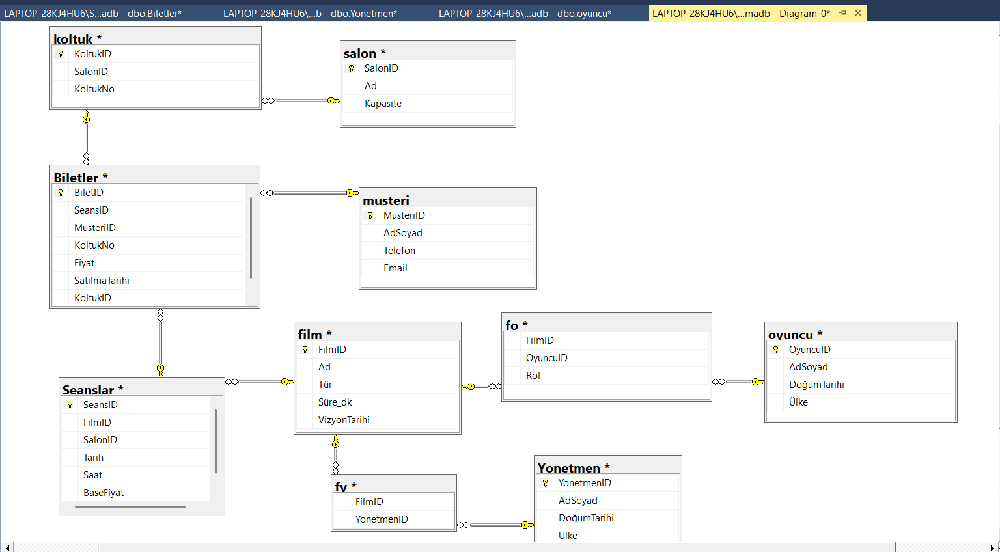

# 🎬 Sinema Bilet Satış Sistemi (CinemaDB)

Bu proje, SQL Server üzerinde geliştirilmiş bir **Sinema Bilet Satış Sistemi** veritabanı örneğidir.  
Amaç; film, seans, bilet, müşteri ve yönetmen bilgilerinin yönetimini kolaylaştırmak için tablolar, triggerlar, fonksiyonlar ve raporlama sorguları oluşturmaktır.

---

## 🗂 Veritabanı Şeması

Projede toplam **10 tablo** bulunmaktadır:

| Tablo | Açıklama |
|-------|----------|
| `dbo.Film` | Sinema filmlerinin temel bilgileri (Ad, Tür, Süre vb.) |
| `dbo.Seanslar` | Filmlerin hangi salonda ve hangi saatte gösterileceği bilgisi |
| `dbo.Biletler` | Satılan biletlerin bilgileri (Seans, Müşteri, Koltuk, Fiyat) |
| `dbo.Musteri` | Sinema müşterilerinin bilgileri |
| `dbo.Yonetmen` | Filmlerin yönetmen bilgileri |
| `dbo.FY` | Film ve yönetmen ilişkilerini tutar |
| `dbo.Koltuk` | Salon koltuk bilgileri ve numaralandırma |
| `dbo.Salon` | Sinema salonları ve kapasiteleri |
| `dbo.Oyuncu` | Filmlerdeki oyuncuların bilgileri |
| `dbo.FO` | Film ve oyuncu ilişkilerini tutar |

**ER Diyagram:**  


---

## 🛠 Kullanılan Yapılar

### 📌 Trigger
**trg_BiletKontrol** → Aynı seans ve koltuk için biletin tekrar satılmasını engeller.

### 📌 Fonksiyonlar
**FilmToplamGelir(@FilmID INT)** → Seçilen film için toplam satış gelirini hesaplar.

### 📌 Örnek Sorgular
**Her seansın satılan bilet sayısı**
```sql
SELECT SeansID, COUNT(BiletID) AS SatilanBilet
FROM dbo.Biletler
GROUP BY SeansID;
```
**En çok bilet satan film**
```sql
SELECT f.Ad AS FilmAdi, COUNT(b.BiletID) AS ToplamBilet
FROM dbo.Film f
JOIN dbo.Seanslar s ON f.FilmID = s.FilmID
LEFT JOIN dbo.Biletler b ON s.SeansID = b.SeansID
GROUP BY f.Ad
ORDER BY ToplamBilet DESC;
```

**50 TL ile 60 TL arasındaki biletler**
```sql
SELECT * FROM dbo.Biletler
WHERE Fiyat BETWEEN 50 AND 60;
```

### 🚀 Çalıştırma

schema.sql dosyasını SQL Server’da çalıştır.

queries.sql içindeki örnek sorguları test et.

er-diagram.png üzerinden tablo ilişkilerini incele.

### ✨ Özellikler

- Film, seans, bilet, müşteri, oyuncu ve yönetmen yönetimi

- Koltuk tekrar satışı engelleme (trigger ile)

- Film bazında toplam gelir hesaplama (fonksiyon)

- Raporlama sorguları: seans bazlı, müşteri bazlı, film bazlı

- Tüm tablo ilişkileri görsel ER diyagramı ile gösterildi

### 👩‍💻 Yazar

@umranyalavuz
